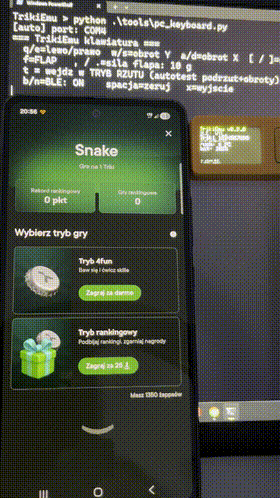

# TrikiEmu

[](https://github.com/Maku-hub/TrikiEmu/actions/workflows/ci.yml)
[](LICENSE)
[](firmware/platformio.ini)
[](https://github.com/Maku-hub/TrikiEmu/releases)

**Software'owy emulator kapsla Żabka Triki** — urządzenie ESP32 w roli BLE
*peripheral* (serwer GATT), które udaje kapsel: reklamuje się jak Triki, wystawia
usługę Nordic UART i nadaje strumień IMU. Aplikacja **Żappka łączy się z nim jak z
prawdziwym kapslem**, a ruch podajesz z komputera (klawiatura / plik / wzorzec).

To **siostrzany projekt  [TrikiScope](https://github.com/Maku-hub/TrikiScope)** (czytnik/inspektor
kapsla).  [TrikiScope](https://github.com/Maku-hub/TrikiScope) jest BLE *centralem* (klientem); TrikiEmu robi odwrotną rolę —
*peripheral*. Cała wiedza o protokole pochodzi z RE w  [TrikiScope](https://github.com/Maku-hub/TrikiScope) i z własnego przechwytu Android HCI snoop.



## Status

- **Test  [TrikiScope](https://github.com/Maku-hub/TrikiScope)** (central) — zaliczony: reklama + GATT zgodne, strumień ~98 Hz.
- **Aplikacja Żappka** — **łączy się i reaguje na ruch** (interop potwierdzony na M5StickC Plus2).
- Sterowanie ruchem z PC po USB-serial: klawiatura (na żywo), plik CSV, wzorzec, autodetekcja portu.
- **Zapis wyniku gry wymaga prawdziwego kapsla** — jest bramkowany kryptograficznym
  uwierzytelnieniem urządzenia (zob. [Zapis wyniku — odkrycie RE](#zapis-wyniku-w-grach--uwierzytelnienie-kryptograficzne-odkrycie-re)).

Pełna specyfikacja protokołu (reklama, GATT, komendy, ramka IMU) i pułapki
implementacyjne: [firmware/README.md](firmware/README.md).

## Jak to działa

```text
PC (źródło ruchu: klawiatura / plik / wzorzec)
   │  USB-serial:  M,gx,gy,gz,ax,ay,az | R | BLE,1 | BLE,0
   ▼
ESP32 (TrikiEmu) ── BLE: reklama jak Triki + NUS + strumień IMU ──► telefon (Żappka)
```

ESP32 odtwarza tożsamość i profil kapsla; PC w czasie rzeczywistym podaje ruch, który
firmware pakuje w ramki Triki (14 B) i nadaje po BLE. Na M5StickC Plus2 można też użyć
wbudowanego IMU jako źródła ruchu.

## Co jest potrzebne

**Sprzęt:**
- Dowolna płytka **ESP32** (testowane na **M5StickC Plus2** / ESP32-PICO-V3-02)
- Kabel USB
- Komputer z Bluetooth
- Telefon z Żappką

**Software:**
- **PlatformIO Core** (CLI): `python -m pip install --user platformio` (lub wtyczka PlatformIO w VSCode)
- **Python 3** + `pyserial` — do narzędzi sterujących z PC (`pip install pyserial`)
- **[TrikiScope](https://github.com/Maku-hub/TrikiScope)**

## Budowanie i wgrywanie

W katalogu `firmware/` (pełny opis: [firmware/README.md](firmware/README.md)).

## Kluczowe: tożsamość BLE (żeby Żappka zaakceptowała)

Żappka rozpoznaje zapamiętany kapsel po **adresie MAC** i emulator musi go **odtworzyć** —
emulator z innym MAC dostaje „nie znaleziono triki". **Adres MAC jest specyficzny dla
egzemplarza**, więc dla własnego kapsla musisz wpisać jego adres — jak go odczytać i gdzie
ustawić (`BLE_ADDR_LE` w firmware) opisuje [firmware/README.md](firmware/README.md).

Pełny kontrakt tożsamości, który emulator odtwarza (reklama, profil GATT, manufacturer data,
service UUID, firmware/bateria, NUS), jest w jednym miejscu:
**[firmware/README.md](firmware/README.md)**.

## Sterowanie z PC (narzędzia w `tools/`)

Wszystkie otwierają port **bez resetu** płytki i **same wykrywają COM** (po VID:PID
mostka ESP32); `--port` podajesz tylko przy kilku płytkach.

| Narzędzie | Do czego |
|---|---|
| `pc_control.py` | jednorazowe komendy: `ble-on` / `ble-off` / `rest` / `raw "..."` |
| `pc_keyboard.py` | **sterowanie na żywo z klawiatury**: obrót/przechył (gry lewo/prawo) + `f`=flap/„szarpnięcie" (gry typu FlappyBird) |
| `pc_motion_file.py` | **odtwarzanie sekwencji ruchu z pliku CSV** |
| `pc_motion_feed.py` | generator wzorca (`--pattern spin\|tilt\|rest`) |
| `pc_replay_capture.py` | **odtwarzanie realnej nagranej sesji** (z btsnoop, reużywa parsera) |

**Klawiatura** (`python tools/pc_keyboard.py`) — jedno wywołanie, dwa tryby (`t` przełącza):
- **TRYB GIER** (domyślny): lewo/prawo (`q`=lewo, `e`=prawo, `a/d`=X, `w/s`=Y, `[`/`]`=siła,
  spacja=zeruj) + FlappyBird (`f`=flap, `,`/`.`=siła flapa).
- **TRYB RZUTU** (podrzut+obroty): klawisze gier wyłączone; wpisujesz **dwie cyfry
  00–20** → rzut następuje automatycznie. Kształt wzorowany na realnym capture (wirowanie z
  nasyconym żyrem + oscylujący wektor accel); autotest liczy obroty z tej oscylacji
  (potwierdzone: odtworzenie nagrania daje dokładny licznik).
- Wspólne: `t`=wejście/wyjście trybu rzutu, `b/n`=BLE on/off, `x`=wyjście. Legenda raz na
  górze; stan w jednej odświeżanej linii (nie przewija konsoli).

**Plik** (`python tools/pc_motion_file.py tools/motion_examples/demo.csv`): CSV 7-kolumnowy
`t,gx,gy,gz,ax,ay,az` = keyframe'y interpolowane przy `--rate`; 6-kolumnowy = surowe próbki.

Protokół serial (gdybyś pisał własne narzędzie) jest opisany w [firmware/README.md](firmware/README.md).

## Przenośność (dowolny ESP32)

Rdzeń (BLE/NUS/strumień/serial) działa na **każdym ESP32**; funkcje M5StickC Plus2 (ekran,
przyciski, IMU, bateria, deep sleep) są opcjonalne. Robione i przetestowane **na M5StickC
Plus2**. Szczegóły (env-y PlatformIO, co działa na gołym ESP32 vs M5, flaga `-D HAS_M5`,
sterowanie przyciskami/ekranem): [firmware/README.md](firmware/README.md).

## Warianty rozważane

Projekt zrealizowano jako **wariant A — software'owa emulacja całej komunikacji BLE**
(ESP32 udaje cały kapsel). Rozważano też alternatywną ścieżkę:

- **B — fałszywy IMU na wewnętrznej magistrali kapsla** (rozważany, **niezbudowany**).
  Pomysł: odłączyć prawdziwy czujnik ST LSM6DSL i podstawić ESP32 jako „fałszywy
  czujnik" (SPI/I²C slave odpowiadający syntetycznym ruchem), zostawiając **prawdziwy
  stos BLE i tożsamość kapsla**. Zaleta: omija tożsamość/bonding/handshake (robi je
  realny kapsel). Wada: mikrolutowanie przy obudowie LGA-14 i ryzyko zniszczenia
  kapsla. Porzucony na rzecz prostszego, czysto software'owego A.

Wybrana platforma: **M5StickC Plus2 (ESP32-PICO-V3-02)**; rdzeń przenośny na każdy ESP32.
Szczegóły kontraktu protokołu i implementacji: [firmware/README.md](firmware/README.md).

## Zapis wyniku w grach — uwierzytelnienie kryptograficzne (odkrycie RE)

Z reverse-engineeringu (zrzut HCI snoop z **prawdziwym** kapslem, analiza
`tools/btsnoop_att.py`) wynika, że **zapis najlepszego wyniku jest bramkowany
kryptograficznym uwierzytelnieniem urządzenia** (challenge–response), wplecionym w
**całą rundę**, a nie w pojedynczy komunikat na końcu:

```text
faza             apka → kapsel (RX 6e400002)      kapsel → apka (TX 6e400003)
──────────────────────────────────────────────────────────────────────────────
START strumienia  20 10 ..
INIT sesji        0a <16B LOSOWY id> <payload>    21 .. (ack) + 8a <id> <dane>   ← liczone z klucza
w trakcie (~1/s)  09 <id> 20 <32B>                89 <licznik> <dane> / 21 <..>  (ramki IMU 22 00 wplecione)
STOP              20 00
domknięcie        09 <id> 20 <32B>  (×~2)         89 / 8a ..
```

- Identyfikator sesji (`id`) jest **losowy na każdą rundę** → odpowiedzi kapsla **nie da się
  odtworzyć** z nagrania.
- Opcode odpowiedzi = opcode żądania `| 0x80` (`0a`→`8a`, `09`→`89`); `21` to status/ACK.
- Odpowiedzi `8a`/`89` są **liczone z sekretnego klucza kapsla**. Aplikacja je weryfikuje, by
  potwierdzić autentyczny kapsel, i **dopiero wtedy zapisuje wynik**.

Klucz kapsla jest w jego
firmwarze pod **APPROTECT** (nie do wyciągnięcia), a losowy `id` sesji wyklucza replay.
Przede wszystkim to mechanizm **uwierzytelniania urządzenia / anty-cheat** chroniący
integralność systemu nagród/rankingu — jego obchodzenie jest **poza granicą projektu**
(patrz niżej). Sama **rozgrywka działa na surowym strumieniu IMU** (dlatego emulator gra),
ale **zapis wyniku wymaga prawdziwego kapsla**.

### Czy to w ogóle da się podrobić? (analiza, dla zainteresowanych)

To klasyczna **atestacja urządzenia** (challenge–response: udowodnij posiadanie sekretu,
nie ujawniając go). Czy da się ją obejść, rozstrzyga **jak aplikacja WERYFIKUJE odpowiedź** —
a tego z samego ruchu nie widać. Trzy modele i ich konsekwencje:

- **Symetryczny (klucz współdzielony)** — apka też zna klucz, sama liczy i porównuje. Wtedy
  **klucz jest w aplikacji** → do wyciągnięcia z APK. Najtańszy i najsłabszy wzorzec; atak
  jest wtedy na apkę, nie na kapsel.
- **Asymetryczny (podpis)** — kapsel podpisuje kluczem **prywatnym**, apka weryfikuje
  **publicznym**. W aplikacji nie ma sekretu → trzeba klucza prywatnego z kapsla. Mocny wzorzec.
- **Weryfikacja serwerowa** — apka oddaje challenge+response do serwera Żabki; lokalnie nic nie wyciągniesz.

Powierzchnia ataku (kategorie):

- **Replay** nagranej odpowiedzi → **odpada**, bo `id` sesji jest losowy (nonce). To zrobiono dobrze.
- **RE aplikacji** → realne tylko w modelu symetrycznym (klucz w apce).
- **Ekstrakcja klucza ze sprzętu** → readout-protection (APPROTECT / flash encryption) bywa
  omijalne znanymi klasami ataków hardware (fault/voltage glitching, side-channel/DPA, decap +
  microprobing) — kosztowne, sprzętowo-specyficzne.
- **Kryptoanaliza protokołu** → jeśli to słabe/„domowe" krypto zamiast standardowego AEAD.

**Bottom line:** jeśli to asymetryk + **unikalny klucz w utwardzonym elemencie** — praktycznie
niewykonalne bez drogich ataków sprzętowych (i o to chodzi: antypodróbkowa atestacja, ta sama
idea co mutual-auth + nonce + klucz w secure element). Realne dziury to zwykle **implementacja**
(klucz w apce, słaby nonce, glitchowalny MCU, brak weryfikacji tam gdzie trzeba) — nie sama idea.

## Przechwytywanie do RE: log Bluetooth (adb) i ekran telefonu (scrcpy)

Narzędzia, którymi powstała powyższa analiza protokołu. Wymagają **Debugowania USB**
(Opcje programisty na telefonie) i potwierdzenia „Zezwól" przy podłączeniu kabla.

**Log komunikacji Bluetooth (HCI snoop)** — co telefon wymienia z kapslem:

1. Telefon: Opcje programisty → włącz **„Dziennik podglądu HCI Bluetooth"**, potem
   **wyłącz i włącz Bluetooth** (logowanie startuje).
2. Odtwórz scenariusz (np. zagraj rundę aż do zapisu wyniku), następnie **wyłącz Bluetooth**
   (to domyka log). **Nie włączaj BT ponownie** do czasu pobrania — ponowne włączenie obcina log.
3. PC (adb jest w paczce scrcpy lub w Android SDK Platform-Tools): uruchom
   `adb bugreport bugreport.zip`. Log siedzi w zip pod `FS/data/log/bt/btsnoop_hci.log`
   (na innych telefonach `FS/data/misc/bluetooth/logs/btsnoop_hci.log`) — wypakuj go do `captures/`.
4. Analiza:
   - `python tools/btsnoop_att.py captures/<log>` — **cały ruch ATT** chronologicznie, mapa
     handle→UUID, okno czasowe `--from/--to`, `--imu` dołącza strumień IMU. Do badania
     komend/handshake'u (np. zapisu wyniku).
   - `python tools/parse_btsnoop.py captures/<log>` — dekoduje **strumień IMU** (ramki 14 B).

**Podgląd ekranu telefonu na PC (scrcpy)** — przydatny przy obserwacji gry podczas RE:

1. Telefon: włącz **Debugowanie USB**, podłącz USB, potwierdź „Zezwól".
2. PC: `winget install --id Genymobile.scrcpy` (paczka zawiera też `adb`).
3. Uruchom `scrcpy` → okno z obrazem telefonu na żywo.

## Zakres i granica (ważne)

Projekt służy **reverse-engineeringowi, interoperacyjności, nauce i testom** z własnym
sprzętem. **Nie** jest narzędziem do nabijania nagród w programie lojalnościowym Żabki
(żappsy, zniżki, nagrody za wyniki w grach) — to nadużycie cudzego systemu.  
Projekt nie jest powiązany z firmą Żabka.
